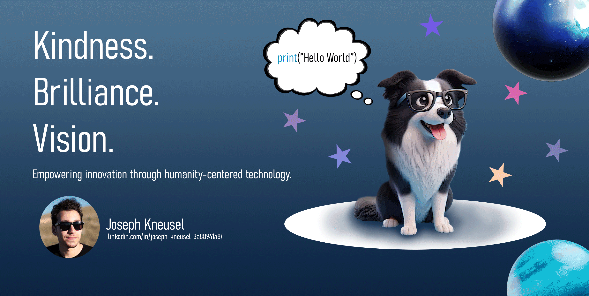
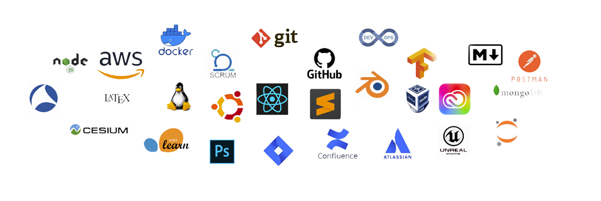

---
#### Overview:
I am a fast learner who can troubleshoot, learn, and use new technologies quickly and proficiently, and adapt well to any environment. I pride myself on my work ethic, tendency to explore creative solutions, and ability to think outside the box. I love building awesome projects, learning about anything and everything, and working to better myself and the world around me. 

---
#### Technical Skills Dump:

*Language Base*

<!--
  

-->

*Development Tools & Methodologies*

<!--
  

-->
---
#### Academic Background:

**UNIVERSITY OF COLORADO, BOULDER**, May, 2025

- *Bachelor of Arts in Computer Science* 💻
- *Bachelor of Arts in English (Writing focus)* 📝

---
#### Recent Employers:
 

- **NATIONAL AERONAUTICS AND SPACE ADMINISTRATION (NASA)**

- **L3HARRIS TECHNOLOGIES** 
***
#### Interests:

| Arts and Humanities Interests       | STEM-Related Interests|  Other Interests |     
|-------------------------------------|-----------------------|------------------|
|Philosophy & Cosmology ✨ |General Sciences 🧪 | Traditional Martial Arts (Taekwondo) 👊 |
|Theology & Religion ✝️ |Marine Biology 🦈 | Endurance Sports 🏃|
|Ancient Literature 📜 |Planetary, Atmospheric, and Oceanographic Studies 🌎 |Video Games 🎮|
|Premodern Literature 📚|Zoology 🐺| Reading, reading, reading 📖|
|Modern & Postmodern Literature 📚|Paleontology 🔬 | Book Collecting 📚|
|Music 🎸|Medicine 🧬| Scuba Diving 🏊‍♂️|
|Visual Arts 🎨|Technology 🖥️| Flying ✈️ |
|Archeology & Cultural Studies 🗼|Artificial Intelligence 🤖| World Travel 🌎|
|Global History 🗺️|Cybersecurity and Cryptography 🔒| Guitar 🎸|
|International Relations 🤝| Astronomy ⭐| Hiking 🥾|
|Linguistics 📖|Aerospace Engineering 🚀| Writing ✍️ |
|Creative Writing ✍️|Nuclear Physics ☣️| Drawing 🎨|
|Language Studies 🗣️|Radiology ☢️| Volunteering ⛑️|
|Classics 🔖|Biomedical Engineering 🩺| Weightlifting 🏋️ |
|Architecture 🏛️|Astrobiology 👽| Programming (Obviously) 🖱️|
|Digital Humanities 💻| Bioastronautics 👾| Dog Ownership 🐕|

| 🔭 Currently Building | 🌱 Currently Studying | 💬 Currently Contemplating | 📖 Currently Reading | ⚡ Currently Hoping For |
|----------|----------|----------|----------|----------|
| An official portfolio website! (JavaScript, CSS, HTML) with a mascot.| Quantum Computing.| Philosophy of Mind.   | *"Moby Dick"*: Herman Melville.  | A full time Software Engineering Position.   |
| Star Spectral Class Prediction ML Project. (Python, Sklearn)| Stellar & Galactic Astronomy. | Artifical Intelligence.| *"The Fellowship of The Ring"*: J.R.R Tolkien.| A STEM Master's Degree in Bioastronautics, Astronautical Engineering, or Biomedical Sciences.|
| Martial Arts Tournament Bracketing Application (Python, Kivy)| Nonfiction Writing and Literature.| Literary Theory. | *"Paradise Lost"*: John Milton.  |A chance to visit Africa, Oceania, or Antarctica.|
| A Hobbit-Hole-Themed Doghouse for my new puppy. | Emergency Medical Care Fundamentals: BLS, CPR, AED. | Mystic Theology. | *"All Things Are Full of Gods"*: David Bentley Hart.  | A Humanities Master's Degree in Archeology, Literature, or Philosophy. |
